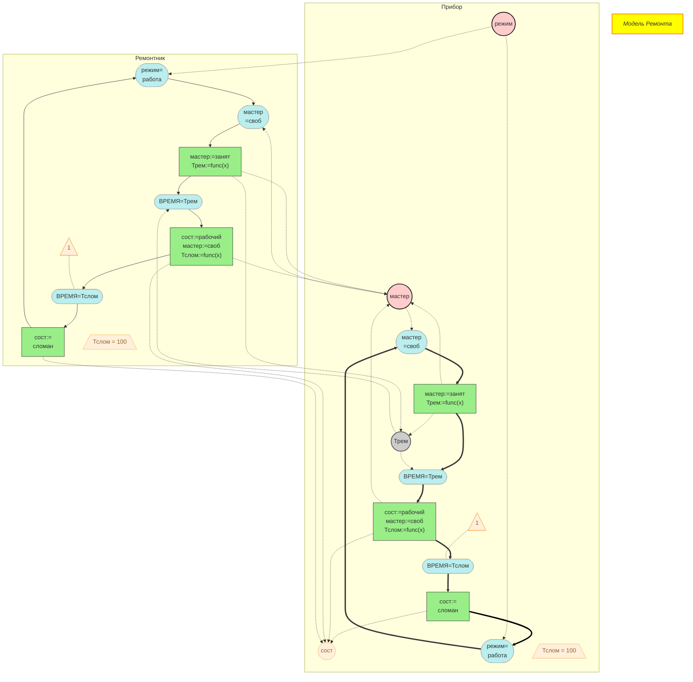

```mermaid
flowchart TB
 subgraph RMT["Ремонтник"]
    direction TB
        n21(["режим=<br>работа"])
        n11(["мастер<br>=своб"])
        n12["мастер:=занят<br>Трем:=func(x)"]
        n14(["ВРЕМЯ=Трем"])
        n15["сост:=рабочий<br>мастер:=своб<br>Тслом:=func(x)"]
        n9(["BPEMЯ=Тслом"])
        n16["сост:=<br>сломан"]
        n19["Тслом = 100"]
        n23["1"]
  end
 subgraph PRB["Прибор"]
    direction TB
        par1(("режим"))
        par2(("мастер"))
        h4(["мастер<br>=своб"])
        h5["мастер:=занят<br>Трем:=func(x)"]
        h6(["ВРЕМЯ=Трем"])
        h7["сост:=рабочий<br>мастер:=своб<br>Тслом:=func(x)"]
        h1(["BPEMЯ=Тслом"])
        par4(("Трем"))
        h2["сост:=<br>сломан"]
        par3(("сост"))
        h3(["режим=<br>работа"])
        n20["Тслом = 100"]
        n24["1"]
  end
    h2 ==> h3
    h2 -.-> par3
    h1 ==> h2
    h5 -.-> par2 & par4
    h3 ==> h4
    h4 ==> h5
    h5 ==> h6
    h6 ==> h7
    h7 ==> h1
    h7 -.-> par3 & par2
    par1 -.-> h3 & n21
    par2 -.-> h4 & n11
    par4 -.-> h6 & n14
    n11 --> n12
    n12 --> n14
    n12 -.-> par2 & par4
    n14 --> n15
    n15 --> n9
    n15 -.-> par2 & par3
    n9 --> n16
    n21 --> n11
    n16 --> n21
    n16 -.-> par3
    n23 -.- n9
    n24 -.- h1
    title["<em>Модель Ремонта</em>"]

    n12@{ shape: rect}
    n15@{ shape: rect}
    n16@{ shape: rect}
    n19@{ shape: trap-b}
    n23@{ shape: tri}
    n20@{ shape: trap-b}
    n24@{ shape: tri}

    class n9,n11,n14,n21 cond
    class n12,n15,n16 state
    class h1,h3,h4,h6 cond
    class h2,h5,h7 state
    class par1,par2 params
    class par4 grayParam
    class n19,n20,n23,n24,par3 Peach
 
    classDef cond fill:#bee,stroke:#aaa,stroke-width:1px
    classDef state fill:#9e8,stroke:#333,stroke-width:1px
    classDef params fill:#fcc,stroke:#111,stroke-width:2px
    classDef grayParam fill:#ccc,stroke:#555,stroke-width:2px
    classDef Peach stroke-width:1px, stroke-dasharray:none, stroke:#FBB35A, fill:#FFEFDB, color:#8F632D
    
    style title fill:yellow,stroke:red
    linkStyle 0 stroke:#000000,fill:none
    
    click par2 href "https://e-learning.bmstu.ru/iu5/" "переход для Мастера" _blank
    click par4 href "https://e-learning.bmstu.ru/iu5/course/view.php?id=124" "переход для Трем" _blank

```